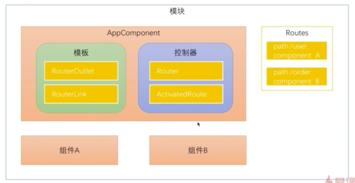
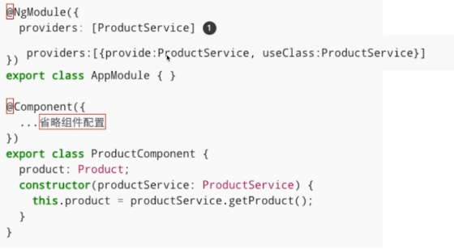

### AngularJs
    
  简介：
  AngularJs是谷歌发布的一个前段框架
1. AngularJs程序架构（组件，指令，服务可以构成一个模块）

<div align='center'>
   
</div>
&nbsp;&nbsp;&nbsp;&nbsp;&nbsp;&nbsp;&nbsp;&nbsp;AngualrJs运行至少需要一个模块，一个组件。

2. 安装angular-cli工具


3. AngularJs常用概念
+ 组件的必备元素
    
   （1）装饰器(@Component)-组件元数据装饰器，用来告知Angular框架如何处理TypeScript类
   
   （2）模版(Template) -定义组件的外观，以HTML的形式存在，告知Angular如何渲染
   
   （3）控制器(Controller) ---控制器处理模版上发生的事件
   
+ 可选属性
   （1）输入属性(@Inputs())---传递数据给子组件
   （2）提供器（providers）---用来做依赖注入
   （3）生命周期钩子 ---根据组件的状态执行逻辑
   （4）样式表(styles)
   （5）动画
   （6）输出属性(@Outputs)

4. @Component 组件元数据装饰器
    Angular通过这个属性，就知道定义个的一个TypeScript类是组件了。@Component中的属性就告诉angular如何定义的组件。
    - select："app-root"。告诉angular可以通过这个名字来引用组件
    
    - templateUrl:'./app.component.html'  告诉Angular如何渲染这个组件
    
    - styleUrls: ['./app.component.css']  组件加载的css文件
    
5. 控制器(controller)

    文件中定义的TypeScirpt类就是控制器，里面包含了数据，逻辑等。
    
6.指令生命周期概述
+ 指令与组件共有的钩子
  
  ngOnChanges
  
  ngOnInit
  
  ngDoCheck
  
  ngOnDestroy
  
+ 组件特有的钩子
  ngAfterContentInit
  
  ngAfterContentChecked
  
  ngAfterViewInit
  
  ngAfterViewChecked
  
### 第二章：开始Angular开发

### 第三章：Angular路由
1. 学习内容
+ 了解路由的基础知识
+ 子路由，保护路由和辅助路由

2. 什么是SPA应用？
    
    一个应用中只有一个主入口，剩下的更新只是内容的改变的应用我们称之为单页应用。Angular应用就是SPA，内容改变只会刷新局部的组件内容。
路由器的作用为某个内容分配一个url。SPA可以理解成一个视图的集合。

3. 路由基础   
 
    (1) 如何使用Anuglar-cli创建一个带有路由模块的Angular项目？
    ```
    ng new router --routing
    ```
    (2) 使用Angular Route导航

    Routes: 路由配置，保存，保存着哪个URL对应展示哪个组件，以及在哪个RouterOutlet中展示组件
    
    RouterOutlet：在HTML中标记路由内容呈现位置的占位符指令
    
    Router：负责在运行时执行路由的对象，可以通过调用其navigate()和navigateByUrl()方法来导航到一个指定的路由
    
    RouterLink：在HTMl中声明路由导航用的指令
    
    ActivatedRoute：当前激活的路由对象，保存着当前路由的信息，如路由地址，路由参数等。
    
    (3) Angualr Route的调用过程。
    <div align='center'>
        
    </div>
    Angular会根据Routes中的路由配置，关联对应的组件，当路由触发时，会调用对应的组件显示在模版中。在模版中可以定义路由插座，来指定路由对应的组件在模版
    中的显示位置。我们可以通过Angular routerLink标签的形式来指定路由的跳转信息，同时也可以通过在控制其中使用Router对象来控制路由的跳转。
    
    (4) 如何在Anuglar中配置路由模块？
    
    使用`ng new router --routing`命令生成的项目中会自带一个app-routing.module.ts文件，这个文件中包含着路由的一些配置信息。当然我们也可以直接在app.module.ts中直接配置路由模块的依赖。
    
     <div align='center'>
            
      </div>
     <div align='center'>
         
     </div>
     
     ```
        const routes:Routes=[
            {
                path:'',
                component:'',
                children:[]
            }
        ]
     ```
     path属性表示路由的路径，children表示子路由的配置信息,component表示路由指向的组件。
     
     (5) 现在我们通过一个小案例来介绍路由的一些用法
     
     现在我们有一个HomeComponent组件，一个ProductComponent组件，使用`ng g component home`命令来生成组件。然后在路由的配置文件中进行路由配置
     
     ```
        import { NgModule } from '@angular/core';
        import { Routes, RouterModule } from '@angular/router';
        import {HomeComponent} from './home/home.component';
        import {ProductComponent} from './product/product.component';
        
        const routes: Routes = [
          {path: '', component: HomeComponent},
          {path: 'product', component: ProductComponent},
        ];
        
        @NgModule({
          imports: [RouterModule.forRoot(routes)],
          exports: [RouterModule]
        })
        export class AppRoutingModule { }

     ```
     上述代码中要注意，配置路由的地址时不能加'/'，因为在配置中默认是跟路经。好了，接下来我们修改app-component.html文件的内容，通过点击a标签的内容，可以进行路由的跳转。
     
     ```
        <a [routerLink]="['/']">主页</a>
        <a [routerLink]="['/product']">商品详情页</a>
        <router-outlet></router-outlet>
     ```
     我们使用[routerLink]指令来进行路由的跳转，这里我们写路由的地址时为什么要加上['/']这种形式呢？原因很简单，我们经常会遇到这种情况，在路由的地址中需要加上参数信息的链接
     通过这种形式，我们可以很轻松的配置参数信息。当然如果在没有路由参数的情况下，我们直接写上路由地址的字符串也是ok的。至此，我们就完成了一个简单的路由跳转的代码。运行`npm start`
     启动angualr项目，在浏览器中点击链接可以发现，内容已经可以切换了。
     
      <div align='center'>
          
      </div>
      至此，我们通过angular中路由指令完成了一个简单的路由跳转功能，接下来我们看一下如何通过在控制器中使用Router对象来控制路由的跳转。
        
      首先我们需要在html中添加一个按钮，添加这个按钮的目的是，点击按钮时能够触发控制器中的事件处理函数，然后在事件处理函数中做路由跳转的操作。
      
      ```
        <a [routerLink]="['/']">主页</a>
        <a [routerLink]="['/product']">商品详情页</a>
        <button (click)="toProductPage()">商品内容</button>
        <router-outlet></router-outlet>
      ```  
      在html代码中我们看到了一个新的指令(click),通过（）+ 事件名的形式我们可以很轻松的绑定事件。关于事件绑定的内容，将会在后续的章节中详细介绍。
     
      接下来，我们修改在app-component.ts中的代码如下：
      
      ```
        import { Component } from '@angular/core';
        import {Router} from '@angular/router';
        
        @Component({
          selector: 'app-root',
          templateUrl: './app.component.html',
          styleUrls: ['./app.component.css']
        })
        export class AppComponent {
          title = 'app';
          constructor(private router: Router) {}
          toProductPage() {
            this.router.navigate(['/product']);
          }
      ```
      
      代码中我们使用到了构造函数，注入了一个Router对象，这样在这个组件中我们就可以使用router了。这里对象是通过构造函数，依赖注入进组件的。有关依赖注入的知识点也会在
       后续章节中详细介绍。最后我们在事件处理函数中调用router的navigate方法，进行路由跳转。好了，这下我们的通过Router对象进行路由跳转功能也已经完成了。接下来我们可以
       看一下效果：
       <div align='center'>
            
       </div>
       
      最后，关于路由的信息，还有一点补充，目前路由跳转的时候都是有对应的组件的，当输入的路由没有相关组件对应时我们应该如何配置呢？很简单，我们只需要在生成一个404组件，然后在
      路由配置中，配置一下匹配规则就可以了。
      ```
        const routes: Routes = [
          {path: '', component: HomeComponent},
          {path: 'product', component: ProductComponent},
          {path: '**', component: Code404Component},
        ];
      ```
      将path设置为**，就可以匹配任意规则了，注意路由匹配的过程是从上之下的，当匹配到了相关的路由，后面的路由就不会继续匹配了，所以类似这种404的路由匹配，应该放在路由的最后。
       
      (6) 如何在路由中传递参数
        
      通过上一节的学习我们知道了，如何使用路由来做跳转，在这一节中我们将会学习如何在路由中传递参数。
      
      在路由中传递参数的方式主要有三种：
        
      + 在查询参数中传递数据
      + 在路由路径中传递数据
      + 在路由配置中传递参数 
      
+ 在查询参数中传递数据

    如何在html中传递：使用指令[queryParams]='{id:1,name:"lisi"}'
    ```
        <a [routerLink]="['/']">主页</a>
        <a [routerLink]="['/product']" [queryParams]="{id:123}">商品详情页</a>
        
        <button (click)="toProductPage()">商品内容</button>
        <router-outlet></router-outlet>
    ```
    queryParams中的参数对象，也可以直接关联到，controller中设置的属性。
    
    如何在控制器中获取：使用ActivatedRoute对象获取
    ```
        import {Component, OnInit} from '@angular/core';
        import {ActivatedRoute} from '@angular/router';
        
        @Component({
          selector: 'app-product',
          templateUrl: './product.component.html',
          styleUrls: ['./product.component.css']
        })
        export class ProductComponent implements OnInit {
        
           productId: number;
        
          constructor(private routerInfo: ActivatedRoute) {
          }
        
          ngOnInit() {
            this.productId = this.routerInfo.snapshot.queryParams['id'];
          }
        
        }

    ```
+ 在路由路径中传递数据 
    
    在路由路径中传递数据，主要分为三步：
    + 在路由配置中给路由加上参数： ` {path: 'product/:id', component: ProductComponent}`
    
    + 在传递参数的组件中，加上参数值: `<a [routerLink]="['/product',123123]">商品详情页</a>`
    
    + 在接受参数的组件中接收: ` this.productId = this.routerInfo.snapshot.params['id'];`  
    
+ 什么是参数快照，和参数订阅  
    
    上面那种获取参数信息的方式我们称之为参数快照。参数快照会存在一个问题，当一个组件从自身跳转到自身时，如果组件的属性值都没有发生变化，只是路由传递的参数值发生了
    变化，那么在组件中获取参数的值是不会发生变化的。那么这就会存在着一个问题，数据没有刷新。这个时候我们就可以使用参数订阅的方式，来订阅参数的改变。
    `  this.routerInfo.params.subscribe(params => this.productId = params['id']);`
    这样我们就可以实时的监听参数的变化了。subscribe是rtjs中的内容，这个在以后的内容中会详细介绍。
    

4. 重定向路由
    
    在用户访问一个特定的地址时，将其重定向到另一个指定的地址。
    
    ```
        const routes:Routes=[
        {path:'',redirectTo:'/home',pathMatch:'full'},// 重定向到home
        {path:'home',compenent:HomeComponent},
        
        ]
    ```
    
    
5. 子路由
    在主目录中会有一个<router-outlet>插座，显示子路由的信息。子路由中也是可以传递参数的。组件本身不知道任何路由相关的信息，都是在组件内部，
    或者配置文件中，配置的。形成的是一个插座的父子关系。
        语法：
     ```
        {path:'home',component:HomeComponent,children:[
            {path:'xxx',component:XXXComponent}
            {path:'yyy/:id',component:YYYComponent}
        ]}
        
        <a [routerLink]="['./']">商品描述</a>
        <a [routerLink]="['./seller',99]">销售信息</a>
        <router-outlet></router-outlet>
        
        
     ```
     
6. 辅助路由
    
    允许你定义多个插座
    ```
    <router-outlet></router-outlet>
    <router-outlet name='aux'></router-outlet>
    
    {path: 'xxx',component:XxxComponent,outlet:"aux"}
    {path: 'yyy',component:YyyComponent,outlet:"aux"}
    
    <a [routerLink]="[{outlets:{primary:'home',aux:'xxx'}}]">Xxx</a>
    <a [routerLink]="[{outlets:{aux:'yyy'}}]">Xxx</a>
    
    ```
    可以通过配置primary设置主路由
    
7. 路由守卫
    
   只有当用户已经登陆并拥有某些权限时灿能进入某些路由
   
   一个由多个表单组件组成的向导，例如注册流程，用户只有在当前路由的组件中填写了满足要求的信息才可以导航到下一个路由。
   
   当用户未执行保存操作而视图离开当前导航时提醒用户
   
   （1） 三种路由守卫
     + CanActive: 处理导航到某路由的情况
     
     + CanDeactivate: 处理当前路由离开的情况
     
     + Resolve：在路由激活之前获取路由数据
     
     就是设置了很多钩子函数
     
 + CanActive
  
    第一步生成守卫对象 login.guard.ts类
     
     ```
        import {CanActivate} from '@angular/router'
        
        export class LoginGuard implements CanActivate{
            canActivate(){
                let loggedIn:boolean =Math.random() <0.5
                
                if(!loggedIn){
                    console.log('用户未登陆！')
                }
                return loggedIn;
            }
            
        }
     ```
     
     第二步 在路由配置中配置守卫的信息
     
     ```
        {path:'home',component:HomeComponent,children:[],canActivate:[LoginGuard]}
      ```
        
     第三步 实例话login.guard类
     
     在@NgModule中的providers属性主添加这个类就ok
     
     
+ CanDeactive
    
      第一步生成守卫对象 Unsaved.guard.ts类。CanDeactive类必须要指定保护的是哪个组件，即离开组件时能够得到通知
       
       ```
          import {CanDeactivate} from '@angular/router'
          import {ProductComponent} from '../product/product.component'
          
          export class UnsavedGuard implements CanDeactivate<ProductComponent>{
              canDeactivate(component:ProductComponent){
                 return window.confirm("您还没有保存确定要离开吗？")
              }
              
          }
       ```
       
       第二步 在路由配置中配置守卫的信息(属性值时数组，可以配置多个守卫)
       
       ```
          {path:'home',component:HomeComponent,children:[],canActivate:[LoginGuard],canDeactive:[UnsavedGuard]}
        ```
          
       第三步 实例话login.guard类
       
       在@NgModule中的providers属性主添加这个类就ok
       
       
            
+ resolve守卫（可以预先在组件加载之前去服务器上读数据）
    
      第一步生成守卫对象 product.resovle.ts类。CanDeactive类必须要指定保护的是哪个组件，即离开组件时能够得到通知
       
       ```
          import {Resovle} from '@angular/router'
          import {ProductComponent} from '../product/product.component'
          @Injectable
          export class ProductResolve implements Resolve<ProductComponent>{
          
            constructor(private router:Router){
            }
             resolve(route:ActivatedRouteSnapShot,state:RouterStateSnapshot):Observable<Product>|Promise<Product>|Product{
                 let productId:number=router.parmas["id"];
                 
                 if(productId==1){
                    return new Product(1,"iphone8")
                 } else {
                    this.router.navigate(['/home']);
                    return undefined;
                 }   
             }
          }
       ```
       
       第二步 在路由配置中配置守卫的信息(属性值时数组，可以配置多个守卫)
       
       ```
          {path:'home',component:HomeComponent,children:[],canActivate:[LoginGuard],canDeactive:[UnsavedGuard],resolve:{
            product:ProductResovle
          }}
        ```
          product是传递给组件的数据
       第三步 实例话login.guard类
       
       在@NgModule中的providers属性ProductResolve
      
    
     
     
   
    
     
        
        
    

  
    

### 第四章：Angular依赖注入
1. 学习内容
    
 + 什么是依赖注入模式以及使用依赖注入的好处
 + 介绍angular的依赖注入实现：注入器和提供器
 + 注入器的层级关系
 
2. 什么是依赖注入，使用依赖注入的好处？
   
   依赖注入：Dependency Injection简称DI
   
   <div align='center'>
      
   </div>
     
   providers:[{provider:ProductService,useClass:ProductService}]
    
   provider相当于是一个token，useClass表示这个token对应的实体类，需要new一个这个类型的实体类
   
  依赖注入的特性：松耦合，可测性

3. 注入器是构造函数，提供器是配置中的provider属性    

     <div align='center'>
          
       </div>
       
     生成服务的命令是：ng g service service.name
     
     当一个提供器声明在模块中时，任何组件都是可以用的。组件中也是可以声明提供器的。服务中也是可以注入其他服务的。服务需要加上@Injectable注解，这个注解的意思是表示
     可以注入其他依赖
     
     工厂提供器：当我们不能仅仅只是通过new来创建一个对象时，我们就需要使用工厂提供器来创建对象
     
     ```
        providers:[{
            provide:ProductService,
            useFactory:(logger:Loggerservice,config)=>{
               // let logger =new LoggerService();
               // let dev =Math.random()>0.5;
                if(config.isDev){
                    return new ProductService(logger);
                }else{
                    return new AnotherProductService(logger);
                }
            },
            deps:[LoggerService,"IS_DEV_ENV"]   //依赖
        },Loggerservice，{
            provide:"IS_DEV_ENV",useValue:{isDev:false}
        }]
        
        工厂方法创建的对象是单例的,变量也是可以跟服务一样，注入的。但是不是useClass而是useValue，useValue可以是任何类型。
        考虑一下如何在其他组件中使用变量
     ```
4. 注入器的层级关系
    应用级注入器，主组件注入器，子组件注入器
    
    找对应的提供器时，先从子组件开始搜索注入器，没有找到就向上搜索，知道搜到位置，如果到了应用级注入器还没有搜到，则会抛出异常。
    
    如何手动的注入服务
    
    ```
        constructor(private injector:Injector){
            this.productService=injecor.get(ProductService);
        }
    ```
 

### 第五章：数据绑定，响应式编程和管道

1. 学习内容
+ 数据绑定

+ 响应式编程

+ 管道

2. 数据绑定
    
    在Angular中默认的数据绑定方式是单向数据绑定。如果改变控制器中的值时，模版上的数据会跟着改变。反之如果使用jquery等js库改变页面上的值时
    控制器中的数据是不会改变的。
       
        <h1>{{productTitle}}</h1>
    使用插值表达式将一个表达式的值显示在模版上
     
        
    使用方括号将HTML标签的一个属性绑定到一个表达式上
    
        <button (click)="toProductDetail()">商品性情</button>
    使用小括号将组件控制器的一个方法绑定为模版傻姑娘一个事件的处理器
    
3. 事件绑定
     <div align='center'>
          
       </div>
4. 属性绑定
    
      angular中的插值表达式和属性绑定其实是一回事。
        
        [] 属性绑定， 。属性绑定的过程中如果少了[],angualr是不会将它作为controller中的变量，绑定的
        
        {{}} 插值表达式  
        
        从实现上来看，Angualr会将插值表达式转换为属性绑定
   
+ DOM属性
    加载页面后，页面上html标签都会被浏览器解析成为dom节点。dom操作会改变dom的值，显示的是当前值。
+ HTML属性
    html属性是保持不变的。html属性指定了初始值。
     
    <input value="Tom" (onclick)="handleClick(event)">
    
    handleClick(event){
        console.log(event.target.value)
        console.log(event.target.getAttribute("value"));
    }
    
    html属性中button 按钮的disabled属性只要加上了这个属性，不管设置为true还是false，都是禁用的。只有是有dom操作
    改变属性值的时候才是有效的，这就是dom属性的价值。
    
+ HTML属性和DOM属性的关系

    + 少量HTML属性和DOM属性之间有着1:1的映射，如id
    + 有些HTML属性没有对应的DOM属性，如colspan
    + 有些DOM属性没有对应的HTML属性，如textContent
    + 就算名字相同，HTML属性和DOM属性也不是同一个东西
    + HTML属性的值指定了初始值；DOM属性的值表示当前值
    + DOM属性的值可以改变；HTML属性的值不能改变
    
   Angular中模版绑定是通过DOM属性和事件来工作的，而不是HTML属性。
   
   DOM属性绑定的过程：
    <div align='center'>
        
    </div>
5. HTML属性绑定
    基本HTMl属性绑定
    
    CSS类绑定
    ```
        <div class="aaa bbb" [class]="someExpression"> something</div>
        <div [class.special]="isSpecial">something</div>
        <div [ngClass]="{aaa:isA,bbb:isB}">
    ```    
    样式绑定：
      ```
        <button [style.color="isSpecial?'red':'green'"]>Red</button>
        
        <div [ngStyle]="{'font-style':this.canSave?'italic':'normal'}">
      ```
      
      table中td标签的colspan属性是只有html属性的，所以在angular中是不能有属性表达式来绑定数据的。
      以下这种写法是不会生效的。
      
      ```
        <table>
            <tr>
                <td colspan="{{1+1}}">Thougthworks</td>
            </tr>
        </table>
      ```
      可以绑定到HTML属性上
      
       ```
          <table>
                  <tr>
                      <td [attr.colspan]="{{1+1}}">Thougthworks</td>
                  </tr>
              </table>
        ``` 
       HTML属性绑定的过程：
            <div align='center'>
                
            </div>
       绑定html属性能够生效是因为改变了HTML属性，html属性变化后触发了dom属性的变化。所以并不是因为angular的
       数据绑定使得dom值发生改变的
       
+ css的绑定
    首先我们有模版文件
    ```
        <div class="a b c">Thoughtworks</div>
    ```
    样式文件为
     ```
        a{
            backgroundColor:yellow;
        }
        b{
            color:red;
        }
        c{
            font-size:20;
        }
     ```
     此时的显示效果为黄底红字
     
     接下来我们使用anugalr的数据绑定，给class绑定相应的值
     ```
        <div [class]='divClass'>Thoutghtworks</div>
     ```
     controller中的代码为
     ```
        divClass:string;
        construtor(){
            setTimeout(()=>{
            this.divClass='a b c'},3000)
        }
     ```
     我们可以看到3秒之后变为黄底红字了。使用这种方式设置class会进行全替换，有时候我们并不想替换所有的样式。
     
     ```
        <div class='a b' [class.c]='isBig'>Thoutghtworks</div>
     ```
      controller中的代码为
      ```
             isBig:boolean;
             construtor(){
                 setTimeout(()=>{
                 this.isBig=true},3000)
             }
      ```
      3秒后字体会变大。如何同时控制多个类名
      
       ```
            <div [ngClass]='divClass'>Thoutghtworks</div>
       ```
        controller中的代码为
            ```
               divClass:any={
                    a:false,
                    b:false,
                    c:false
               };
               construtor(){
                   setTimeout(()=>{
                   this.divClass={a:true,b:true,c:true}},3000)
               }
        ```
        这样就同时在后端控制了多个类名

+ style样式绑定
    style样式绑定的方法基本与class绑定的过程一致
    ```
        <div [style.color]="isDev?'rede':'blue'">ThoughtWorks</div>
    
    ```
    controller中的代码为：
   ```
           isDev:boolean=true;
           construtor(){
               setTimeout(()=>{
               this.isDev=false},3000)
           }
    ```
    可以看到3秒之后，字体由红色变为了蓝色
    
   在css中经常会用到一些单位，例如px如何在绑定过程中使用这些单位呢？
    
    ```
        <div [style.font-size.em]='isDev?3:1'>Thoughtworks</div>
    ```
    如何设置多个内联样式呢？
    ```
        <div [ngstyle]="divStyle">ThougthWorks</div>
    ```
    controller中的代码
    ```
        divStyle:any={
            color:'red',
            background-color:'yellow'
        }
        constructor(){
           setTimeout(()=>{
            this.divStyle={
                color:'yellow',
                background-color:'red'
            }
           })
        }
    ```

6. 双向绑定
    通过双向绑定我们可以使得模型和视图保持同步。之前使用input，通过事件改变数据模型，使得dom节点中的数据发生改变
    这种绑定方式是单向数据绑定。Angualr默认是单向绑定的，但angualr是支持双向数据绑定的。双向数据绑定最常用在表单
    处理上。用在div，span元素上是没用的。
    使用[(ngModel)]指令可以实现双向绑定
    
    
7. 管道

    管道是处理原始值到显示值的一个转换。多个管道可以连在一起，同时生效
    
    ```
        <p>我的生日是{{birthday | date | uppercase}}</p>
    ```
    angular中内置了十几个管道，我们介绍几个最常用的管道
        date   可以加参数  date: 'yyyy-MM-dd HH:mm:ss'
        uppercase
        lowercase
        number 格式化数字。 | number:'2.1-4'' 1 表示最少的小数位，4表示最多的小数位。如果最小小数位不够会补0
        async 异步管道
        
+ 自定义管道
    
    使用ng g pipe pipe/mutiple 命令生成管道，组件和管道都是需要声明在declarations属性中的
    ```
        import {Pipe,PipeTransform} from '@angular/core';
        @Pipe({
            name:'multipe'
        })
        export class MultiplePipe implements PipeTransform{
            transform(value:number,args?:number):any{
                if(!args){
                    args=1;
                }
                return value*args;
            }
        }
    ```
    
    
### 第六章：组件间的通信
1. 在介绍本章内容前，我们先来看一下一张图，程序从本质上看都是一颗组件树。1号组件是整个组件的根
    包含2，3，6组件，2号组件又包含4，5两个子组件，在设计一个组件时我们要尽量保证组件是松耦合的，
    组件之间相互知道，交互的越少越好，松耦合的组件重用性才高。假设我们点击了组件4中的一个按钮时，
    触发了组件5中的一段逻辑。按照传统的做法，我们会在组件4中调用组件5的方法，这么做的话组件4就和
    组件5紧密关联在了一起。有没有可能组件4在根本不知道组件5的情况下，实现上面的需求呢？答案是肯定的
    在上一章里，我们介绍了如何使用依赖注入来开发松耦合的组件，但是光有依赖注入是不够的。在这一章里
    我们会介绍如何使用一种松耦合方式开实现高重用性的组件 ，首先我们会学习组件的输入输出属性，在两个具有
    父子关系的组件间传递数据。然后我们会介绍使用中间人模式传递数据，以及如何实现一个中间人模式，以便在
    没子组件进行通信，最后我们会学习组件生命周期以及angualr的变化发现机制。
    
    <div align='center'>
       
    </div>
2. 学习内容
+ 组件的输入输出属性
+ 使用中间人模式传递数据
+ 组件生命周期以及angualr的变化发现机制

3. 组件的输入属性

4. 组件的输出属性
    Angualr组件可以使用一个EventEmitter对象来发射事件，这些事件可以被其他组件所处理。EventEmitter对象
    是rxjs中Subject类的子类，在响应式编程中，它既可以作为被观察者，也可以作为观察者。它既可以通过他的emit方法
    来发射事件，也可以用subscribe方法来订阅eventemitter发射的事件流。
    + 在组件中发射事件流
    子组件中的代码为：
    ```
        export class PriceQuoteComponent implements OnInit {
            stockCode:String = "IBM";
            price: numebr;
            // 可以通过指定名字
            @Output("priceChange")
            lastPrice:EventEmitter<PriceQuote> =new EventEmitter();
            
            constructor(){
                setInterval(()=>{
                    let priceQuote:PriceQuote =new PriceQuote(this.stockCode,this.price*Math.random());
                    this.price = priceQuote.lastPrice;
                    this.lastPrice.emit(priceQuote);
                },1000)
            }
        }
        
        export class PriceQuote {
            constructor (public stockCode:String, public price: number){
            }
        }
    ```
    
    app-component中html代码为：
    ```
    <app-price-quote (priceChange)="priceQuoteHandler($event)">
    </app-price-quote>
    <div>
        这是父元素
    </div>
    <div>
        股票代码是{{priceQuote.stockCode}},
        股票价格是{{priceQuote.lastPrice | number:'2.2.-2'}}
    <div>
    ```
    + 在父组件中接收事件流
    ```
        export Class AppComponent {
            stock = '';
            priceQuote: PriceQuote = new PriceQuote('',0);
            
            priceQuoteHandler(event: PriceQuote){
                this.priceQuote = event;
            }
        }
    ```
    
    事件名和@Output()指定的事件名是一样的。这里是利用@output装饰器向外发射事件，并通过事件携带
    数据，但是这个事件只能通过父组件，通过绑定事件处理函数的形式来获取数据，如果我们现在的组件不存在
    这种父子关系，那我们应该如何处理呢？这就是接下来要介绍的中间人模式。

5. 中间人模式
    
    组件应该是内聚的，不应该依赖外部的组件，要实现这样的松耦合的组件，我们需要使用到中间人模式。
    让我们回顾一下本章开始的那张图。组件1是整个组件树的跟组件，组件1可以充当组件2，3，6的中间人
    组件2，可以充当组件4，5的中间人，组件3可以充当组件7，8的中间人。中间人负责从一个组件接收数据，
    然后将数据传递给另一个组件。以我们上一节的股票价格为例，我们有两个组件，报价组件和下单组件，报价组件
    需要将股票价格，传递给下单组件，但是这两个组件并不存在父子关系。
    
    子组件中的代码为：
     ```
            export class PriceQuoteComponent implements OnInit {
                stockCode:String = "IBM";
                price: numebr;
                // 可以通过指定名字
                @Output("priceChange")
                lastPrice:EventEmitter<PriceQuote> =new EventEmitter();
                @Output()
                buy: EventEmitter<PriceQuote> = new EventEmitter();
                
                constructor(){
                    setInterval(()=>{
                        let priceQuote:PriceQuote =new PriceQuote(this.stockCode,this.price*Math.random());
                        this.price = priceQuote.lastPrice;
                        this.lastPrice.emit(priceQuote);
                    },1000)
                }
                buyStock(event){
                    this.buy.emit(new PriceQuote(this.stockQuote,this.price))
                }
            }
            
            export class PriceQuote {
                constructor (public stockCode:String, public price: number){
                }
            }
      ```
        
     app-component中html代码为：
      ```
       <app-price-quote (buy)="buyHandler($event)">
       <app-order [priceQuote]="priceQuote"></app-order>
       
      ```
      
      + 在父组件中接收事件流
      ```
              export Class AppComponent {
                  stock = '';
                  priceQuote: PriceQuote = new PriceQuote('',0);
                  
                  buyHandler(event: PriceQuote){
                      this.priceQuote = event;
                  }
              }
      ```
      + 下单组件
      ```   
        exprot class OrderComponent implements OnInit {
            @Input()
            priceQuote: PriceQuote;
            
            constructor() {
            
            }
            ngOnInit() {
            }
        }
        
      ```
      orderComponent组件的html代码
      ```
        <div>我是下单组件</div>
        <div>
            买100手{{priceQuote.stockCode}}股票</br>
            买入的价格是{{priceQuote.lastPrice}}
        
      ```
      但是我们需要注意的是，报价组件是没有任何和下单组件相关的东西，报价组件只是把自己的价格发射
      出去。在这个例子中我们使用了一个父组件，来作为兄弟组件的中间人。如果我们两个组件根本不是兄弟
      组件，这种情况下怎么办。组件4和组件6根本没有共同的父组件，这时我们应该使用可注入的服务作为中间人
      ，组件可以订阅这个服务发射的事件流。在与服务器通信的那一章节会介绍使用服务来作为中间人（在实战的讲解中）。
    

6. 组件生命周期钩子函数
    
    在组件的生命周期中会发生各种各样的事件，从组件的创建开始，angular的变更检测机制就会开始监控组件，组件
    被创建以后会被添加到dom树上，并且由浏览器渲染。在这之后组件的属性可能会发生变化，这会导致组件被重新渲染
    最后组件会被销毁。在我们这张图上我们展示了组件的所有的生命周期钩子函数，这些钩子可以在特定的组件特定的生命周期
    事件发生时，执行你需要的事件逻辑。图中红色的方法只会执行1次，而绿色的方法会被多次调用，这些钩子分布在生命周期的三个
    阶段：初始化阶段，变更检测阶段，组件销毁阶段。在组件的初始化完成后，看到组件。变更检测机制会保证组件的属性与页面的显示
    保证同步。如果由于路由等操作，组件从dom树上移除，angualr会执行组件的销毁。
    
   <div align='center'>
      
   </div>
   
   使用ng -g component name 命令生成的组件中，是默认实现了OnInit接口的，每一个钩子都是@angular/core里定义的一个接口
每一个接口都有一个唯一的钩子方法。方法的名字是由ng+接口名子组成的。 从纯技术的角度来讲， 接口对于javascript和typescript开发者
都是可选的，javascript语言本身是没有接口这一概念的，angualr在运行时看不到Typescript接口，Typescript中定义的接口在编译成javascript的时候
已经消失了。幸运的是，实现这些接口的生命不是必须的，不用写implements 接口也能调用钩子函数，angular会检查组件的类，一旦发现钩子方法被定义了，就调用
它，angular会找到ngOnInit方法，有没有这个implements OnInit无所谓。但是还是建议添加接口，这样可以获得Ide的一些支持，以及一些强类型的检查。
下面我们来实现所有的生命周期的接口：
    ```
        let logIndex: number =1;
        export class LifeComponent implements OnInit,OnChanges,DoCheck,AfterContentInit,
            AfterContentChecked,AfterViewInit,AfterViewChecked,OnDestory{
            @Input()
            name:String;
            
            logIt(msg: string){
                console.log(`#${logIndex++} ${msg}`)
            }
            
            constructor(){
                this.logIt("name属性在constructor里的值是"+name);
            }
            // ngOnChanges传入了一个SimpleChanges对象，里面包含了改变前的值和改变后的值
          
            ngOnChanges(changes: SimpleChanges):void{
                let name = changes['name'].currentValue
                this.logIt("name属性在ngOnChanges里的值是"+name);
            }    
            
            ngOnInit(){
                 this.logIt('ngOnInit');
            }
            
            ngAfterContentInit(): void{
                 this.logIt('ngAfterContentInit');
            }
            
            ngAfterContentChecked(): void {
                 this.logIt('ngAfterContentChecked');
            }
            
            ngAfterViewInit(): void {
                 this.logIt('ngAfterViewInit');
            }
            
            ngAfterViewChecked(): void {
                 this.logIt('ngAfterViewChecked');
            }
            
            ngDoCheck(): void{
                this.logIt('ngDoCheck');
            }
            
            ngOnDestory(): void{
                 this.logIt('ngOnDestory');
            }
            
            
        }
    ```
    app-component组件内容
    
      ```
        export class AppComponent{
            title = "Tom";
        }    
      ```
      ```
        <app-life [name] = "title"></app-life>
      ```
    浏览器输出结果：
    ```
       #1 name属性在constructor里的值是：
       #2 name属性在ngOnChanges里的值是：Tom
       #3 ngOnInit
       #4 ngDoCheck
       #5 ngAfterContentInit
       #6 ngAfterContentChecked
       #3 ngAfterViewInit
       #3 ngAfterViewChecked       
    ```
    ngOnchanges在ngOnit方法之前调用，属性如果是传值进入组件的就会调用ngOnChanges方法。如果组件依赖传入的值，这个时候初始化操作就不要写在
    contructory里，而是需要写在ngOnInit方法里。ngDoCheck是关于变更检测的，是在angualr的变更检测周期中调用。ngAfterContentInit,ngAfterContentChecked
    是跟组件的内容投影相关的。ngAfterViewInit，ngAfterViewChecked是跟组件的模版的初始化检查相关的。
    注意这些例子只是实现angular在加载组件的过程中的执行顺序。在真正的开发过程中我们并不需要实现所有的组件，我们只需要实现
    我们所用到的钩子函数即可。angualr在执行过程中，如果实现了钩子函数就执行，没有实现就跳过。
    
    

7. onChanges钩子函数
    
    这个钩子是在父组件初始化或修改子组件的输入参数时调用。在理解ngOnchages钩子函数在什么时候会被调用，什么时候不会被调用时，我们需要理解两个概念就是
    什么是可变对象，什么是不可变对象。在javascript中字符串是不可变的，对象是可变的。
    ```
        var greeting = 'hello';
        greeting = 'hello world';
        
        var user = {name:'Tom'};
        user.name = 'Jack';
    ```
    在js中字符串创建之后会分配一个内存地址，当我们修改了值之后，会分配一个新的地址给这个变量。所以当我改变值时，已经换了一个地址，所以以前的内容是不可变的。
    对象就不一样了，改变了对象的某一个属性值，其内存地址是不变的但是值的内容却发生改变了。
    我们通过一个例子来看看ngOnChanges的调用过程：
     
    首先我们创建一个child组件`ng -g component child`
    ```
        export class ChildComponent implements OnInit {
            @Input()
            greeting: string;
            
            @Input()
            user:{name:string};
            
            message:string = "初始化消息";
            
            constructor() {
            
            }
            
            ngOnInit() { 
            
            }
            
            ngOnChanges(changes: SimpleChanges): void {
                console.log(JSON.stringify(changes,null,2))
            }
        }
    ```
    childComponent的模版
    ```
      <div class ="child">
           <h2>我是子组件</h2>
           <div>问候语：{{greeting}}</div>
           <div>姓名：{{user.name}}</div>
           <div>消息：<input [(ngModel)] = "message" ></div>
      </div>  
    ```
    childComponent的样式
    ```
        .child {
            backgroundColor:lightblue;
        }
    ```
    
   开始写父组件：appComponent
   ```
    export class AppComponent {
      greeting:string ='hello';
      user:{name:string} ={name:'Tom'};
      constructor(){
      }  
    }
    ```
    父组件模版：
    ```
        <div class="parent">
            <h2>我是父组件</h2>
            <div>
                问候语：<input type='text' [(ngModel)='greeting']>
            </div>
             <div>
                姓名：<input type='text' [(ngModel)='user.name']>
            </div>
            <app-child [greeting]='greeting' [user]='user'></app-child>
        </div>
        
    ```  
   父组件样式   
   ```
        .parent{
            backgroundColor:cyan;
        }
   ```  
   
   显示效果：
   
    页面初始化的时候，因为默认是空，传入的值，就会触发ngOnChanges方法
    改变greeting的值，会调用ngOnChanges方法
    改变user.name的值，不会调用ngOnChanges的方法
    改变user.name的值，不会调用ngOnChanges方法，但是子组件的值变了，这是因为angular的检测机制
    改变message的值，也不会嗲用ngOnChanges方法，这是以为message在子组件中不是一个输入属性，没有有@Input装饰器注解
    
   结论：
    ngOnchanges方法只会在不可变值改变并且是输入属性时才调用
    
  
8. 变更检测和DoCheck函数
    
    angular的变更检测机制是由zone.js来实现的，我们可以在package.js中找到zone.js的依赖包。这个包的主要目的是保证
    属性的变化和页面的显示保持同步。浏览器中的任何异步事件，都会触发变更检测。比如点击按钮，输入数据，请求服务器，调用
    setTimeout方法等。当变更检测运行时，他会检测模版上所有绑定关系。如果一个组件的属性被改变，那么被绑定的属性的模版区域则会要进行相应的更新。
    需要注意的是变更检测机制永远不会改变属性的值，只是将变化的属性的值反应到模版上。目前我们的angular项目是一个以主组件为根的组件树，当angualr应用运行时
    每个组件都会生成一个属于自己的变更检测器，当任何一个变更检测器检测到变化时，zone.js就会根据组件的变更检查策略来检查组件，以判断组件是否需要更新他的模版。
    
    （1）angular实现了两种变更检测策略 default策略，OnPush策略
    
       <div align='center'>
          
       </div>
       如果所有的组件都使用default策略，那么不管变更发生在哪个组件上，zone.js都会检测整颗组件树。如果某个特定的组件生命自己的变更策略
       为OnPush,那么只有当这个组件的输入属性发生变化的时候，zone.js才会检测这个组件以及这个组件的子组件，还是会从跟组件开始往下检测，当遇到
       设置变更检测策略为onpush的组件时，只有当这个组件的输入属性变化时，才会检测这个组件以及其子组件。
        <div align='center'>
          
        </div>
        
        我们来看一个稍微复杂点的例子，如上图所示，当孙子组件1发生变化的是时候，整个的组件树中除了子组件2，不会被检查意外，其他所有的组件都会被检查一遍
        所谓的检查就是调用docheck方法。检查是由整个组件的跟组件开始的，往下检查所有的组件，不管变更发生在什么位置。只有在子组件2的输入属性发生变化的时候才会检查
        这个组件。
        
        监听属性的变化，实现一个DoCheck钩子，childComponent组件中：
      ```
          export class ChildComponent implements OnInit,DoCheck {
                    @Input()
                    greeting: string;
                    
                    @Input()
                    user:{name:string};
                    
                    message:string = "初始化消息";
                    
                    oldUsername:string;
                    
                    changeDetected:boolaen = false;
                    
                    noChangeCount:number =0;
                    
                    constructor() {
                    
                    }
                    
                    ngOnInit() { 
                    
                    }
                    
                    ngOnChanges(changes: SimpleChanges): void {
                        console.log(JSON.stringify(changes,null,2))
                    }
                    
                    ngDoCheck(): void{
                        if(this.user.name != this.oldUsername) {
                            this.changeDetected = true;
                            console.log("DoCheck:user.name从"+this.oldUsername+"变为"+this.username);
                        }
                        
                        if(this.changeDetected){
                            this.noChangeCount = 0;
                        }else {
                            this.noChangeCount = this.noChangeCount+1;
                            console.log("DoCheck:user.name没变化时ngDoCheck方法已经被调用"+this.noChangeCount+"次")；
                        }
                        this.changeDetected = false;
                    }
                }
      ```
      可以发现在input框中点击时不改变值也会触发DoCheck方法的调用。ngDoCheck钩子函数会被非常频繁的调用。所以，我们对ngDoCheck方法的调用必须
      非常轻量，高效，不然很有可能会引起性能问题。如果钩子函数上有check关键字，当组件发生变化时，所有组件中实现了带有check关键字的钩子函数都会被
      重新执行
        
9. view钩子
    
    接下来我们会介绍ngAfterViewInit,ngAfterViewChecked这两个钩子。
    之前我们介绍过，angular应用其实就是一颗组件树，在这颗组件树上我们可以通过，绑定@Output参数来获取子组件中的数据，通过@Input参数来接收父组件传过来的
    数据。但是在有些情况下父组件需要调用子组件中的方法。接下来我们看一下如何在父组件中和模版中调用子组件的方法。首先我们来创建一个childComponent组件
    
    ```
       export class ChildComponent implements OnInit {
            constructor() { }
            
            ngOnInit() {
            
            }
            
            greeting(name:string) {
                console.log("hello"+name);
            }
       } 
    ```
    
    父组件模版
    ```
        <app-child #child1></app-child>
        <app-child #child2></app-child>
    ```
    父组件ts文件
    ```
       export class AppComponent implements OnInit{
          @ViewChild("child1")
          child1:ChildComponent;
          
          constructor() {
          
          }
          
          ngOnInit(): void{
            this.child1.greeting("thougthworks")
          }
       } 
    ```
    在AppComponent中声明一个由@ViewChild装饰器声明的一个变量。这个装饰器的属性可以指定一个字符串，指向子组件。
    通过这个装饰器我们可以通过这个变化获得子组件的引用。获得这个引用之后我们可以在或组件的任何方法里调用子组件的方法。
    运行程序后可以看到控制台中输出了hello thoughtworks，这说明在父组件中成功的调到了子组件中的方法。接下来我们看一下如何
    在父组件的模版中调用子组件中的方法。
    ```
         <app-child #child1></app-child>
         <app-child #child2></app-child>
         <button (click) = "child2.greeting('ThoughtWorks')">click me</button>
    ```
    运行程序在页面中点击按钮会在控制台打印 hello ThoughtWorks的信息，说明成功的调到了#child2中的方法。
    好了现在我们已经了解到了如何在父组件中调用子组件的代码。在这个的基础上我们来看一下我们说的那两个钩子。
    
    首先我们来修改一下父组件
    ```
         export class AppComponent implements OnInit,AfterViewInit, AfterViewChecked {
            @ViewChild("child1")
            child1:ChildComponent;
            message:string;
                  
            constructor() {
                  
            }
                  
            ngOnInit(): void{
              this.child1.greeting("thougthworks");
              this.message = 'hahaha';
            }
            ngAfterViewInit(): void{
                setInterval(()=>{
                    console.log("父组件的视图初始化完毕！")  
                },5000)
            }
            ngAfterViewChecked(): void {
                console.log("父组件的视图变更检测完毕！") 
            }
          } 
    ```
    我们在父组件上实现这两个钩子函数，这两个钩子是在组件的模版，所有的内容都被组装完成以后，组件的模版已经呈现给用户看了之后，
    这两个方法才会被调用。同样我们需要在子组件中实现这两个钩子
    ```
           export class ChildComponent implements OnInit,AfterViewInit, AfterViewChecked{
                constructor() { }
                
                ngOnInit() {
                
                }
                
                greeting(name:string) {
                    console.log("hello"+name);
                }
                
                ngAfterViewInit(): void{
                    console.log("子组件的视图初始化完毕！")  
                }
                ngAfterViewChecked(): void {
                    console.log("子组件的视图变更检测完毕！") 
                }
           } 
    ```
    根据控制台的输出，我们可以看到先输出了子组件初始化完毕，在输出了子组件的视图变更检测完毕！，由于父组件中有两个子组件
    所以输出了两次，然后再是输出的父组件初始化完毕，父组件的视图变更检测完毕！。这说明父组件是等到所有的子组件完全组装好了之后
    才能完成组装。ngAfterViewInit方法只会执行一次（这是在不触发视图更新的前提下），调方法的动作会触发变更检测机制，所以
    ngAfterViewChecked的会被执行，变更一次会调用所有组件的ngAfterViewChecked的方法。所以会出香两次子组件变更检测完毕。
    
    如果我们在父组件中声明一个message变量，然后在父组件的ngAfterViewInit()方法中改变这个值，那么会出现什么现象呢？这个时候
    angular会抛出一个异常，这是因为angualr在一个变更检测周期中，是禁止在一个视图组装好了之后再去更新这个属性。这是angular自身的一个
    规定。ngAfterViewInit这个钩子就是在视图已经组装好了之后触发，同样我们把改变属性的语句写在ngAfterViewChecked中也会发生异常。
    想解决这个问题，也很简单，我们需要把这个赋值语句放在另一个时间循环里面利用setTimeout函数
    setTimeout(()=> this.message = 'hahaha',0)
    
    在使用ngAfterViewInit(),和ngAfterViewChecked()是需要注意的地方有：
     + ngAfterViewInit 在ngAfterViewChecked方法之前被调用
     + 这两个钩子都是在视图组装完毕以后调用的  
     + 如果组件有子组件，那么只有当所有子组件的视图装完毕后 ，父组件的这两个方法才会被调用
     + 不要在这两个钩子函数中改变你视图中所绑定的属性，想改变也要写在一个setTimeout里面
  
10. ngContent指令
    下面我们会去讲ngAfterContentInit,和ngAfterContentChecked这两个钩子。在介绍这两个钩子之前，我们还要介绍angualr的一个
    新概念叫投影。在某些情况下，我们在编写通用化的组件时，对于组件的部分内容，我们希望在调用组件时，把剩余的展示的内容传到组件中来，
    这时我们就需要使用到投影.
    声明一个子组件
    ```
        <div class ="wrapper">
            <h2>我是子组件</h2>
            //子组件中定义一个投影点
            <ng-content></ng-content>
        </div>
    ```
    父组件中
     ```
        <div class ="wrapper">
            <h2>我是父组件</h2>
            <app-child-component>
                <div>我是从父组件中投影进子组件的内容</div>
            </app-child-component>
           
        </div>
     ```
     
     接下来，如果我们需要从父组件中传入多个内容，并显示在子组件中的不同位置时，我们应该怎么做呢？
     
     声明一个子组件
     ```
            <div class ="wrapper">
                <ng-content select='.header'></ng-content>
                <h2>我是子组件的内容</h2>
                //子组件中定义一个投影点
                <ng-content select='.footer'></ng-content>
            </div>
     ```
     父组件中
      ```
            <div class ="wrapper">
                <h2>我是父组件</h2>
                <app-child-component>
                    <div class='header'>我是从父组件中投影进子组件的头部内容，title是{{title}}</div>
                    <div class='footer'>我是从父组件中投影进子组件的底部内容</div>
                </app-child-component>
               
            </div>
      ```
      需要注意的是，投影的内容虽然是传进子组件的，但是不能使用子组件中的属性，title是来自父组件的属性。
      
      如何用属性绑定传入html内容?利用innerHTML来实现
      
      <div [innerHTML]="divContent">
      在ts文件中定义有属性：
      divContent='<div>ThoughtWorks</div>';
      
      ngContent只能绑定父组件中的属性值，而innerHTML只能绑定当前组件中的属性，所以我们应该根据情况来使用。
      innerHTML是浏览器端的特定的属性，而ng-content是angualr有的属性，当要把应用转换成hybird开发的应用时
      ng-content可能会更通用一些。
      接下来会介绍与投影相关的声明周期钩子。
      
      ngAfterContentInit,ngAfterContentChecked是在被投影的内容组装完成后调用的。现在来写一个简单的例子:
      
      在父组件中：
       ```
           export class AppComponent implements AfterContentInit,AfterContentChecked,AfterViewInit { 
            ngAfterContentInit(): void{
                console.log("父组件投影内容初始化完毕！")
            }
            
            ngAfterContentChecked: void{
                console.log("父组件投影内容变更检测完毕！")
            }
            ngAfterViewInit: void {
                 console.log("父组件视图内容变更检测完毕！")
            }
            title ='app works'
           } 
       ```
       
       在子组件中：
       
       ```
         export class ChildComponent implements AfterContentInit,AfterContentChecked,AfterViewInit { 
          ngAfterContentInit(): void{
            console.log("子组件投影内容初始化完毕！")
          }
                   
          ngAfterContentChecked: void{
            console.log("子组件投影内容变更检测完毕！")
          }
      
         }  
       ```
      实际的调用顺序为：
      ```
        父组件投影内容初始化完毕！
        父组件投影内容变更检测完毕！
        子组件投影内容初始化完毕！
        子组件投影内容变更检测完毕！
        父组件视图内容变更检测完毕！
      ``` 
      这说明一个组件在组装他的整个视图的时候，首先组装的是否组件投影进子组件的内容，然后组装的是子组件的内容。这两个地方都组装完毕后，再组装的是父组件
      的内容。ngAfterContentInit() 与ngAfterViewInit()不同，前者是组件还没有初始化完毕，所以可以在方法内改变组件的属性值。
       
     ngOnDestory() {
     }
     当从一个路由跳转到另一个路由时，前一个组件会调用ngOnDestory方法。会在这个方法中清除一些资源，如定时器。
    
    


### 第七章： 表单处理
1. 表单处理内容介绍
  
  angular为表单处理提供了丰富的功能。  
  
  模版式表单
  
  响应式表单
  
  表单验证
2. 表单简介

    纯HTML表单
    + 显示表单项
    + 校验用户输入
    + 提交表单数据
3. 模版式表单

    使用模版式表单时只 能使用指令来定义数据模型。都有那些指令呢？之前介绍过如何使用NgModel来使用双向绑定。在表单中，他还有另外一个左右，表示这个
    元素应该成为表单模型的一部分。
    NgForm： 用来代表整个表单，在angular应用里，他会被自动的添加到form标签上。当form标签上写了post，action等属性时都会失效，因为angular已经
    接管了这个表单。隐式的创建了一个FormGroup实例，这个类用来表示表单的数据模型，并且储存表单的数据。ngFrom可以用在form之外的标签，比如div。如果不希望
    angular帮你处理表单需要在form标签上声明一个ngNoForm指令。#myform="NgForm"。使用(ngSubmit) ="onSubmit(myForm.value)"来处理提交事件
    
    NgModel：会隐式的创建一个FormControl模型，并用这个对象来存储字段的值。在form中使用ngModel时不需要使用[()]扩起来的，也不需要绑定属性。但是我们需要为ngModel的元素
    添加一个name属性。ngmodel指令绑定的元素也可以使用本地变量来应用 #username= "ngModel"
    
    NgModelGroup: 代表的是表单的一部分，他允许你将表单字段组织在一起，形成更清晰的层次关系。与NgForm指令类型，NgModelGroup指令也会创建一个FormGroup对象。用一个div包裹
    两个input元素，并在div上使用NgModelGroup ="userInfo"声明，这样FormGroup中的数据会多一个层级嵌套
    
    三部曲：
    + 使用NgForm声明表单为angular表单
    + 使用ngModel，绑定input元素中的数据
    + 使用NgModeGroup 组织表单字段值
    
4. 响应式表单
    首先我们需要一个编码实现一个数据模型，然后利用指令将html链接到这个数据模型上。如何创建一个模型，数据模型是一个用来表示表单数据的数据结构，简称模型。它有定义在
    angular/forms模块中三个类组成：
    
    FormControl:他是构成表单的基本单位，通常情况下用来代表一个input元素，FormControl保存着与当前元素关联的值，以及元素的校验状态，还有元素是否被修改过等信息。
    
    username: FormControl = new FormControl('a');
    FormControl接收一个参数作为input元素的初始值，当我们将这个属性与input元素连接时，input元素的初始值就是a
    
    FormGroup： 既可以用于代表表单的一部分也可以代表整个表单，他是多个FormControl的集合，FormGroup将多个FormControl的值聚合在一起。后面讲表单验证的时候
    如果一个formcontrol的值是无效的那么整个formgroup的值都是无效的。例如我们在验证日期的时候，有一个起始日期和一个结束日期。可以把这两个input放在一个group里面
    如果一个不过，都会显示错误信息。FormGroup接收一个对象作为参数：
    ```
        formGroup:FormGroup = new FormGroup({
            start: new FormControl('a'),
            end: new FormControl('b')
        })
    ```
    FormArray: 是显示一系列相同的input元素，例如email
    ```
            emails:FormArray = new FormArray([
                new FormControl('aaaa@qq.com'),
                new FormControl('bbbb@qq.com'),
                new FormControl('ccc@qq.com'),
            ])
    ```

    
    FormArray中的formcontrol是没有一个相关的key的，只能通过index来访问
    
+ 响应式表单中用到的指令，响应式表单中使用一组完全与模版表单中不一样的指令，这些指令主要来自与ReactiveFormsModule模块中。
    
    类名===================指令
    
    FormGroup===========formGroup==========formGroupName
    FormControl===========formControl==========formControlName
    FormArray===========     ==========formArrayName
    
    响应式表单只能在代码中操作，模版式表单只能在模版中操作，响应式表单不能够使用本地变量引用到表单的对象。angualr中是故意这么
    实现的，响应式表单本身就已经是在对象中了。
    formControl需要用属性绑定语法，而formControlName使用字符串。所以在FormGroup中只能使用fromControlName
5. 响应式表单重构
6. 表单校验
7. 状态字段
8. 模版式表单校验

### 第八章：与服务器间的通信
1. 与服务器通讯内容介绍
2. web服务器
3. http通讯
4. websocket通讯

