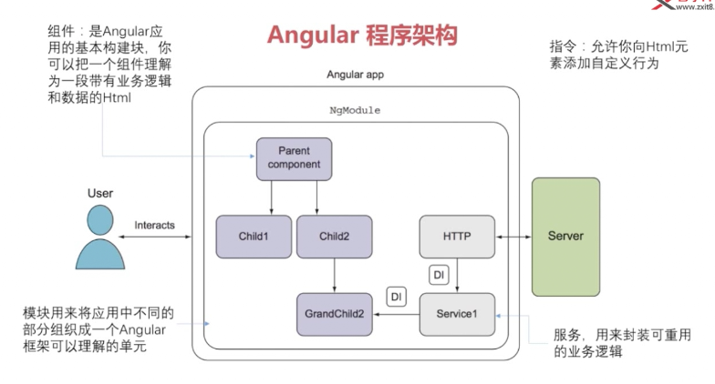
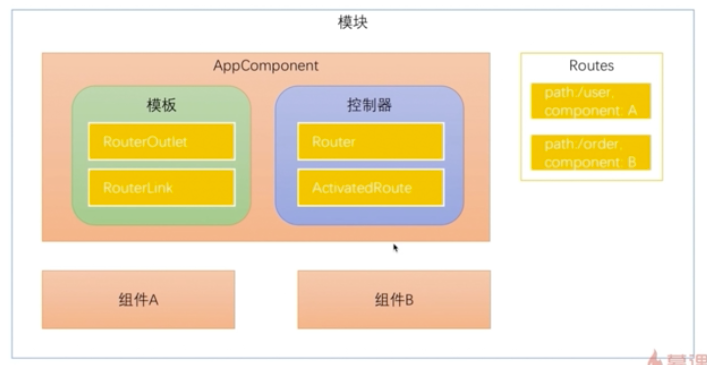
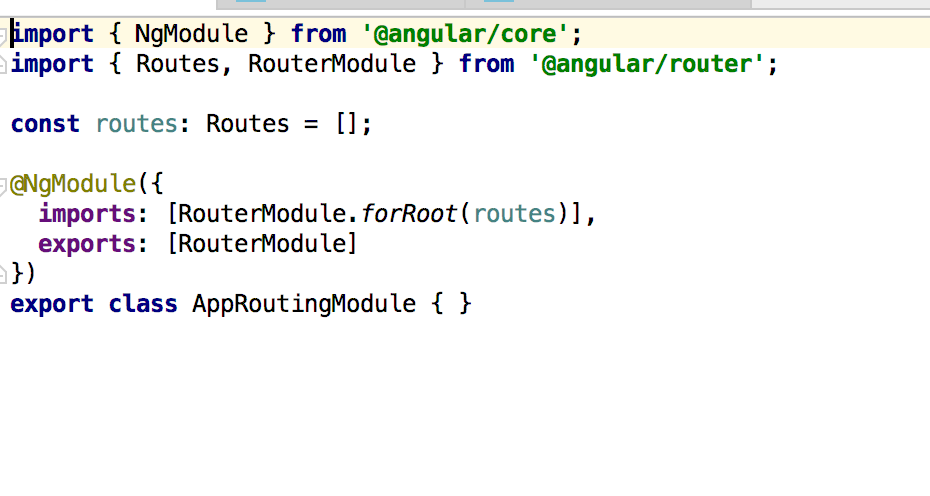
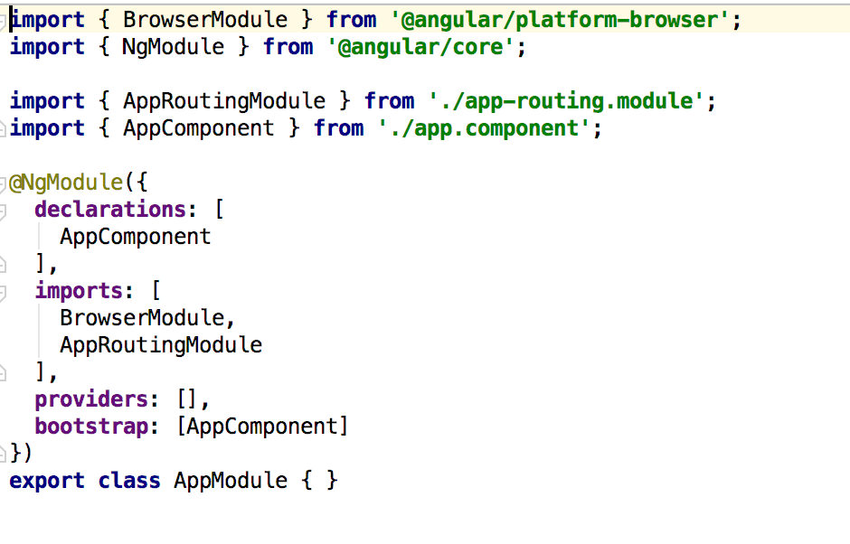

### 第一章 AngularJs
    
  简介：
  AngularJs是谷歌发布的一个前段框架
  
  1 AngularJs程序架构（组件，指令，服务可以构成一个模块）

<div align='center'>
   
</div>
&nbsp;&nbsp;&nbsp;&nbsp;&nbsp;&nbsp;&nbsp;&nbsp;AngualrJs运行至少需要一个模块，一个组件。

   
  2 安装angular-cli工具


  3 AngularJs常用概念
  + 组件的必备元素
    
   （1）装饰器(@Component)-组件元数据装饰器，用来告知Angular框架如何处理TypeScript类
   
   （2）模版(Template) -定义组件的外观，以HTML的形式存在，告知Angular如何渲染
   
   （3）控制器(Controller) ---控制器处理模版上发生的事件
   
   
   + 可选属性

   （1）输入属性(@Inputs())---传递数据给子组件
   
   （2）提供器（providers）---用来做依赖注入
   
   （3）生命周期钩子 ---根据组件的状态执行逻辑
   
   （4）样式表(styles)
   
   （5）动画
   
   （6）输出属性(@Outputs)

  4 @Component 组件元数据装饰器
    Angular通过这个属性，就知道定义个的一个TypeScript类是组件了。@Component中的属性就告诉angular如何定义的组件。
    - select："app-root"。告诉angular可以通过这个名字来引用组件
    
    - templateUrl:'./app.component.html'  告诉Angular如何渲染这个组件
    
    - styleUrls: ['./app.component.css']  组件加载的css文件
    
  5 控制器(controller)

    文件中定义的TypeScirpt类就是控制器，里面包含了数据，逻辑等。
    
  6 指令生命周期概述
  
   + 指令与组件共有的钩子
  
    ngOnChanges
  
    ngOnInit
  
    ngDoCheck
  
    ngOnDestroy
  
   + 组件特有的钩子
    
    ngAfterContentInit
  
    ngAfterContentChecked
  
    ngAfterViewInit
  
    ngAfterViewChecked
    
### 第二章：Angular路由
学习内容
+ 了解路由的基础知识
+ 子路由，保护路由和辅助路由

    1 什么是SPA应用？
    
    一个应用中只有一个主入口，剩下的更新只是内容的改变的应用我们称之为单页应用。Angular应用就是SPA，内容改变只会刷新局部的组件内容。
路由器的作用为某个内容分配一个url。SPA可以理解成一个视图的集合。

    2 路由基础   
 
    (1) 如何使用Anuglar-cli创建一个带有路由模块的Angular项目？
    ```
    ng new router --routing
    ```
    (2) 使用Angular Route导航

    Routes: 路由配置，保存，保存着哪个URL对应展示哪个组件，以及在哪个RouterOutlet中展示组件
    
    RouterOutlet：在HTML中标记路由内容呈现位置的占位符指令
    
    Router：负责在运行时执行路由的对象，可以通过调用其navigate()和navigateByUrl()方法来导航到一个指定的路由
    
    RouterLink：在HTMl中声明路由导航用的指令
    
    ActivatedRoute：当前激活的路由对象，保存着当前路由的信息，如路由地址，路由参数等。
        
    (3) Angular Route的调用过程。
        <div align='center'>
            
        </div>
        Angular会根据Routes中的路由配置，关联对应的组件，当路由触发时，会调用对应的组件显示在模版中。在模版中可以定义路由插座，来指定路由对应的组件在模版
        中的显示位置。我们可以通过Angular routerLink标签的形式来指定路由的跳转信息，同时也可以通过在控制其中使用Router对象来控制路由的跳转。
        
    (4) 如何在Anuglar中配置路由模块？
        
    使用`ng new router --routing`命令生成的项目中会自带一个app-routing.module.ts文件，这个文件中包含着路由的一些配置信息。当然我们也可以直接在app.module.ts中直接配置路由模块的依赖。
        
     ```
         <div align='center'>
                
          </div>
         <div align='center'>
             
         </div>
         
         const routes:Routes=[
                {
                    path:'',
                    component:'',
                    children:[]
                }
            ]
     ```
     path属性表示路由的路径，children表示子路由的配置信息,component表示路由指向的组件。
         
     (5) 现在我们通过一个小案例来介绍路由的一些用法
     
     现在我们有一个HomeComponent组件，一个ProductComponent组件，使用`ng g component home`命令来生成组件。然后在路由的配置文件中进行路由配置
          
     ```
             import { NgModule } from '@angular/core';
             import { Routes, RouterModule } from '@angular/router';
             import {HomeComponent} from './home/home.component';
             import {ProductComponent} from './product/product.component';
             
             const routes: Routes = [
               {path: '', component: HomeComponent},
               {path: 'product', component: ProductComponent},
             ];
             
             @NgModule({
               imports: [RouterModule.forRoot(routes)],
               exports: [RouterModule]
             })
             export class AppRoutingModule { }
     
     ```
          
    上述代码中要注意，配置路由的地址时不能加'/'，因为在配置中默认是跟路经。好了，接下来我们修改app-component.html文件的内容，通过点击a标签的内容，可以进行路由的跳转。    
     
     ```
         <a [routerLink]="['/']">主页</a>
         <a [routerLink]="['/product']">商品详情页</a>
         <router-outlet></router-outlet>
     ```
  
