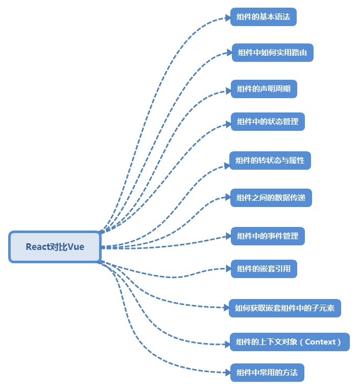

### 一、React和Vue的比较
      React和Vue都是目前市场上的主流框架。通过自己对React和Vue的学习之后，主要从如下几个方面来比较学习两个框架。
<div align=center>
    
</div>

> 组件的基本语法

> 组件的路由 
+ 1.如何使用路由的写法？

    React中路由的写法：
```
方法一：
    import React from 'react'
    import { render } from 'react-dom'
    import { Router, Route, Link } from 'react-router'
    //只写出了路由部分的代码，组件部分的其他代码没有给出
    <Router>
        <Route path="/" component={App}>
        <!-- 指定了index页面 -->
        <IndexRoute component={Dashboard} />
        <Route path="about" component={About} />
        <Route path="inbox" component={Inbox}>
            <Route path="messages/:id" component={Message} />
        </Route>
        </Route>
  </Router>

方法二：
    const routes = {
        path: '/',
        component: App,
        indexRoute: { component: Dashboard },
        childRoutes: [
            { path: 'about', component: About },
            {
            path: 'inbox',
            component: Inbox,
            childRoutes: [{
                path: 'messages/:id',
                onEnter: ({ params }, replace) => replace(`/messages/${params.id}`)
            }]
            },
            {
            component: Inbox,
            childRoutes: [{
                path: 'messages/:id', component: Message
            }]
            }
        ]
    }

    render(<Router routes={routes} />, document.body)
 
```
 路由的跳转，使用<Link>标签：
```
  <Link to=""></Link>
```

    Vue中路由的写法:
```
 方法一：
    import Vue from 'vue'
    import Router from 'vue-router'
    Vue.use(Router);
    let router = new Router({
        mode:'history',
        routes:[{
            path:'/',
            redirect:'/apple'
        },{
            path:'/apple/:type',
            <!-- component:Apple, -->
            component:{
                viewA:Apple,
                viewB:RedApple
            },
            <!-- name属性为路由取别名，在router-link中的跳转路径直接使用别名就可以跳转 -->
            name:"applePage",
            children:[{
                path:"red",
                component:RedApple
            }]
        }]
    })
方法二：
    直接将routes赋值给一个变量
    let routes=[{
            path:'/',
            redirect:'/apple'
        },{
            path:'/apple/:type',
            <!-- component:Apple, -->
            component:{
                viewA:Apple,
                viewB:RedApple
            },
            <!-- name属性为路由取别名，在router-link中的跳转路径直接使用别名就可以跳转 -->
            name:"applePage",
            children:[{
                path:"red",
                component:RedApple
            }]
        }];
    router.push(routes);
   
   
```
 使用这种可编程式的路由方式可以用作一些权限判断路由的跳转

 vue中路由的调用与跳转
    <router-view name="viewA" />   <!-- 为视图指定name属性，在component中进行调用 -->

    <router-link :to="{path:'/apple'}"></router-link>
+ 子组件中如何获取路由的参数

+ UI与URL分离

+ 路由中的钩子函数
> 组件的声明周期

> 组件的状态与属性

> 组件的状态管理

> 组件之间的数据传递

> 组件中的事件管理

> 组件间的嵌套引用

> 组件中子元素的引用

> 组件的上下文对象

> 组件中常用的方法
